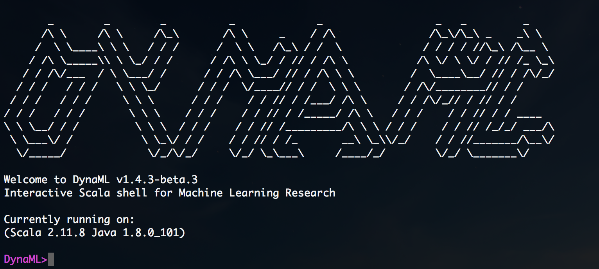
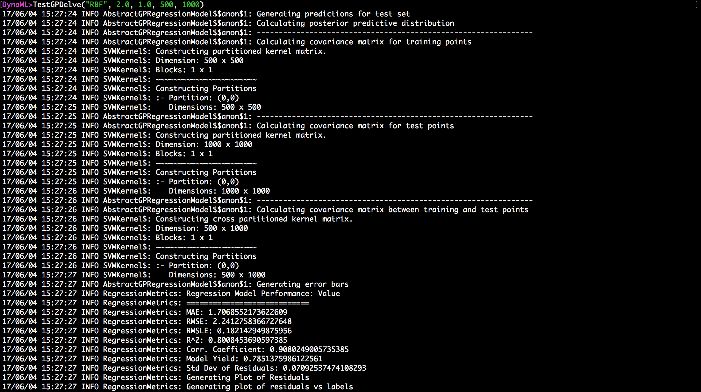

[](https://gitter.im/mandar2812/DynaML?utm_source=badge&utm_medium=badge&utm_campaign=pr-badge&utm_content=badge)
[](https://travis-ci.org/transcendent-ai-labs/DynaML)
[](https://jitpack.io/#mandar2812/DynaML)


## What is DynaML?

DynaML is a Scala environment for conducting research and education in Machine Learning. DynaML comes packaged with a powerful library of classes for various predictive models and a Scala REPL where one can not only build custom models but also play around with data work-flows.



## Hello World

Refer to the [installation](installation/installation.md) guide for getting up and running. The `data/` directory contains data sets, which are used by the programs in the `dynaml-examples/` module. Lets run a Gaussian Process (GP) regression model on the synthetic 'delve' data set.

```scala
DynaML>TestGPDelve("RBF", 2.0, 1.0, 500, 1000)
```



In this example `TestGPDelve` we train a GP model based on the RBF Kernel with its bandwidth/length scale set to `2.0` and the noise level set to `1.0`, we use 500 input output patterns to train and test on an independent sample of 1000 data points. Apart from printing a bunch of evaluation metrics in the console DynaML also generates Javascript plots using Wisp in the browser.


