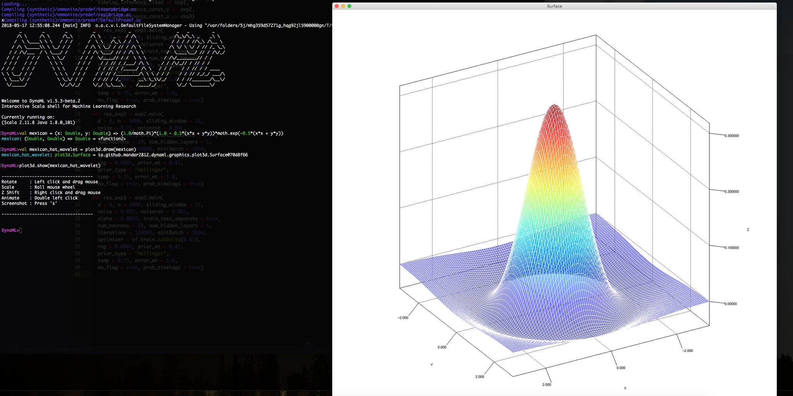

# Summary

``DynaML`` is a Scala platform which aims to provide the user with an toolbox for research in
data science and machine learning. It can be used as 

   * A scala shell, local or remotely hosted.
   
   ```bash
   $ dynaml
   
   Welcome to DynaML v1.5.3-beta.3 
   Interactive Scala shell for Machine Learning Research
   
   Currently running on:
   (Scala 2.11.8 Java 1.8.0_101)
   
   DynaML> 

   ```
   
   * A standalone script engine.
   
   ```bash
   $ dynaml ./scripts/cifar.sc
   ```
   
   * As a binary dependency for JVM based machine learning applications.
   
   ```scala
   libraryDependencies += "com.github.transcendent-ai-labs" % "DynaML" % "master-SNAPSHOT"
   ```

## Motivation & Design

``DynaML`` aims to provide an _end to end_ solution for research and development in
 machine learning, statistical inference and data science. Towards these goals, it 
 provides the user with modules for.
 
  * Data pre-processing using functional transformations. 
  These transformations or [_pipes_](https://transcendent-ai-labs.github.io/DynaML/pipes/pipes/), 
  can be joined to form complex processing pipelines.
  
  * Training [predictive models](https://transcendent-ai-labs.github.io/DynaML/core/core_model_hierarchy/), 
  with a special focus on _stochastic processes_, _kernel_ methods & neural networks. 
  The [model API](https://github.com/transcendent-ai-labs/DynaML/wiki/Models) can be extended
  to implement customized and complicated algorithms.
  
  * [Model tuning](https://transcendent-ai-labs.github.io/DynaML/core/core_opt_global/) & hyper-parameter optimization.
  
  * [Model evaluation](https://transcendent-ai-labs.github.io/DynaML/core/core_model_evaluation/)
  
  * Visualization: two and [three](https://transcendent-ai-labs.github.io/DynaML/core/core_graphics/) dimensional charts.

## Scala Ecosystem

Scala [@scala] is a high level _object oriented_ & _functional_ programming language which 
runs on the _Java Virtual Machine_ (JVM). Its expressiveness, multi-threading model and 
ability to execute on the JVM enable the prototyping and development of potentially large scale 
and data intensive applications.

The scala eco-system has a number of useful packages which ``DynaML`` leverages such as, 
Tensorflow [@tensorflow2015] support through _Tensorflow for Scala_ [@tfscala], 
the [breeze](https://github.com/scalanlp/breeze) linear algebra library and the 
[Ammonite](http://ammonite.io) project.


## Applications


``DynaML`` has been applied in research into _Gaussian Process_ based 
geomagnetic time series prediction [@GPDst] & [@GPDst] and in on-going research in 
MCMC based Bayesian inverse PDE problems specifically _Fokker Planck_ 
based plasma radial diffusion systems [@2017AGU]. 

It can be accessed via the [online repository](https://github.com/transcendent-ai-labs/DynaML), 
or imported as a managed dependency into JVM projects via [jitpack](https://jitpack.io/#transcendent-ai-labs/DynaML).

The [user guide](https://transcendent-ai-labs.github.io/DynaML/) contains information regarding installation, usage, 
API documentation (Scaladoc) as well as usage examples.

.

# Acknowledgements

``DynaML`` was conceived during the [_Master of Science, Artificial Intelligence_](https://onderwijsaanbod.kuleuven.be/opleidingen/e/CQ_50268936.htm#activetab=diploma_omschrijving) 
program at the KU Leuven and further developed during the PhD research carried out in the project 
[_Machine Learning for Space Weather_](https://projects.cwi.nl/mlspaceweather/) which is a part of the 
[CWI-INRIA International Lab](https://project.inria.fr/inriacwi/home/).


# References